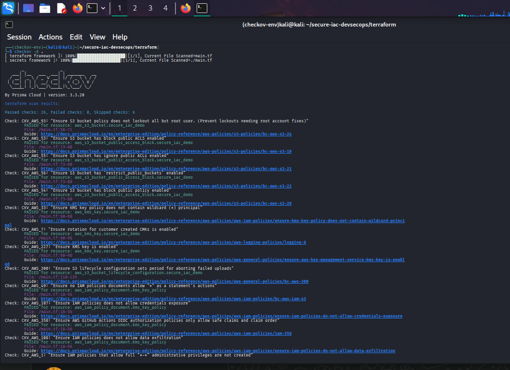
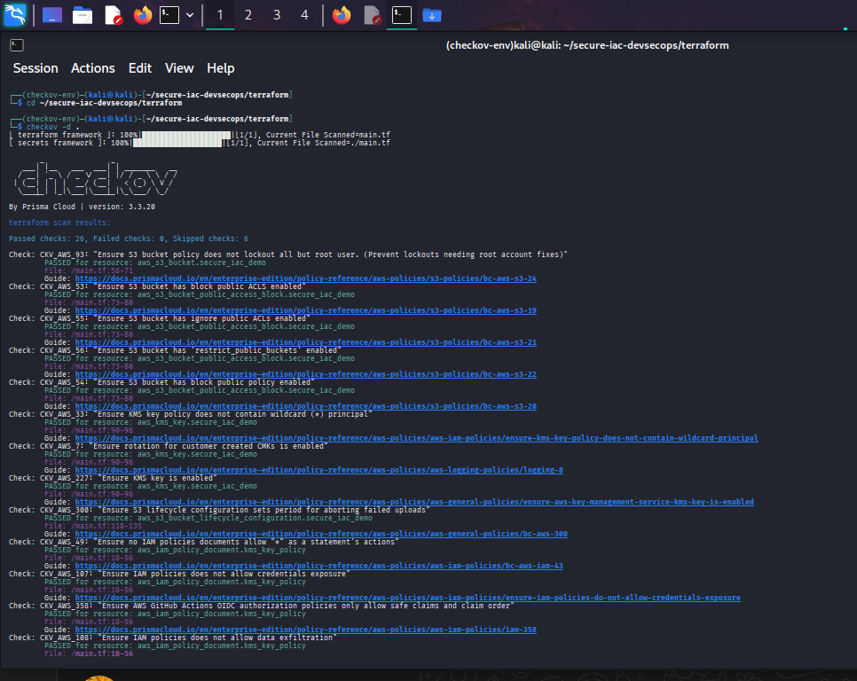
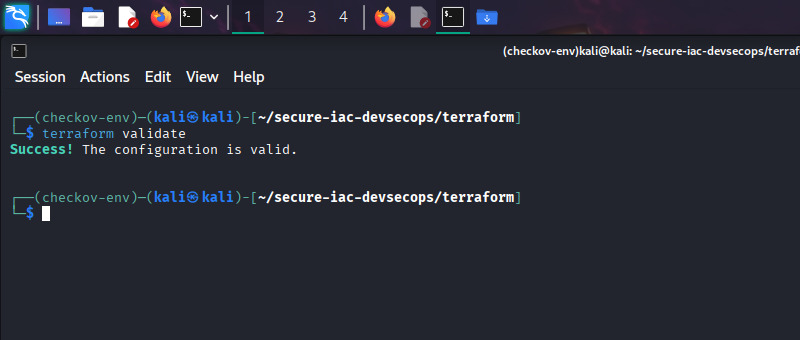
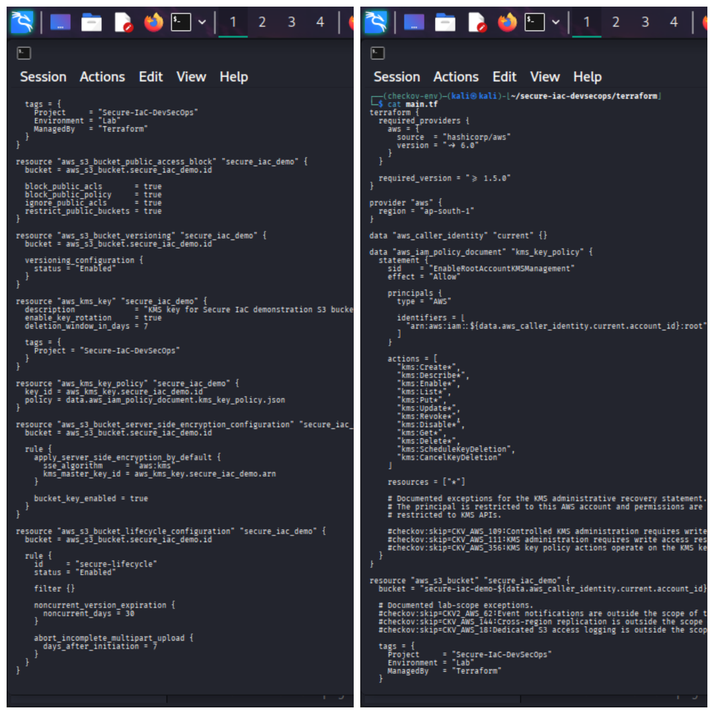

# 🛡️ Secure Infrastructure as Code (IaC) DevSecOps

### Terraform + AWS + Checkov + GitHub Actions

A practical Cloud Security and DevSecOps project demonstrating **secure Infrastructure as Code, automated security scanning, remediation, validation, and CI security gates**.

---

## 🚀 Project Overview

This project demonstrates a practical **Shift-Left Cloud Security** workflow using:

- Terraform
- AWS
- Checkov
- Git
- GitHub Actions

The goal is to identify Infrastructure-as-Code security issues **before infrastructure deployment**, remediate applicable findings, document justified exceptions, and automatically validate the configuration through CI.

---

## 🏗️ Architecture

**Developer → Terraform → Checkov → Remediation → Terraform Validation → GitHub → GitHub Actions → Security Gate**

The Terraform infrastructure contains an AWS S3 bucket protected with AWS KMS and multiple security controls.

---

## 🔐 Security Controls Implemented

### S3 Security

- 🔒 S3 Public Access Block
- 🗂️ S3 Versioning
- ♻️ S3 Lifecycle Management
- 🔐 AWS KMS Server-Side Encryption
- 🔑 S3 Bucket Key
- 🏷️ Resource tagging

### KMS Security

- 🔐 Customer-managed KMS key
- 🔄 Automatic KMS key rotation
- 🛡️ KMS key policy
- ⏳ 7-day deletion window

---

## 🔎 Checkov Security Scanning

Checkov was used to scan the Terraform configuration for AWS security and compliance issues.

### Before Remediation

**Passed:** 5  
**Failed:** 7  
**Skipped:** 0

The initial scan identified multiple security and compliance controls requiring remediation or documented scope decisions.

### After Remediation

**Passed:** 26  
**Failed:** 0  
**Skipped:** 6

The final scan achieved **zero failed checks**.

The remaining skipped controls are explicitly documented as **lab-scope exceptions** inside the Terraform configuration.

---

## 🛠️ Security Remediation

The project demonstrates remediation of Terraform security findings including:

- S3 public access protection
- S3 versioning
- S3 lifecycle configuration
- S3 KMS encryption
- KMS key rotation

Controls outside the intended demonstration scope were documented using Checkov skip annotations with explanations rather than being silently ignored.

---

## 🤖 GitHub Actions DevSecOps Pipeline

The project includes an automated GitHub Actions workflow located at:

**`.github/workflows/security-scan.yml`**

The pipeline performs:

**1. Repository Checkout**

**2. Terraform Setup**

**3. Terraform Format Check**

**4. Terraform Initialization**

**5. Terraform Validation**

**6. Checkov Installation**

**7. Checkov Security Scan**

The workflow runs automatically on:

- Push
- Pull Request

This creates an automated **Infrastructure-as-Code Security Gate**.

---

## 🔄 DevSecOps Workflow

**Write Terraform**

↓

**Run Checkov**

↓

**Identify Security Findings**

↓

**Remediate Findings**

↓

**Document Valid Exceptions**

↓

**Terraform Format Check**

↓

**Terraform Validate**

↓

**Git Commit**

↓

**GitHub Push**

↓

**GitHub Actions**

↓

**Automated Checkov Scan**

↓

**Security Gate**

↓

**PASS / FAIL**

---

## 📊 Validation Results

### Terraform

**Terraform Format Check:** PASS

**Terraform Validate:** PASS

### Checkov

**Initial Failed Checks:** 7

**Final Failed Checks:** 0

### GitHub Actions

**Terraform Security Scan:** PASS

---

## 📸 Project Evidence

### Checkov Before Remediation

Initial Checkov scan showing security findings before remediation.

---

### Checkov After Remediation

Final Checkov scan showing zero failed security checks.

---

### Terraform Validation

Terraform configuration successfully validated.

---

### Terraform Security Controls

Terraform configuration showing implemented AWS security controls.

---

### GitHub Actions Success

GitHub Actions successfully executing the automated Terraform security pipeline.

---

## 📁 Project Structure

secure-iac-devsecops/

├── .github/

│   └── workflows/

│       └── security-scan.yml

├── terraform/

│   ├── main.tf

│   └── .terraform.lock.hcl

├── screenshots/

│   ├── 01-checkov-before.png

│   ├── 02-checkov-after.png

│   ├── 03-terraform-validate.png

│   ├── 04-security-controls.png

│   └── 05-github-actions-success.png

├── .gitignore

└── README.md

---

## 🧰 Technologies Used

| Technology | Purpose |
|---|---|
| Terraform | Infrastructure as Code |
| AWS S3 | Cloud Storage Infrastructure |
| AWS KMS | Encryption and Key Management |
| Checkov | IaC Security Scanning |
| GitHub Actions | CI Security Automation |
| Git | Version Control |
| Linux | Security Engineering Environment |

---

## 🛡️ Skills Demonstrated

- Infrastructure as Code Security
- Cloud Security
- AWS Security
- S3 Security
- AWS KMS
- Encryption at Rest
- IAM and KMS Policy Analysis
- Security Misconfiguration Detection
- Security Remediation
- Checkov
- Terraform
- Git
- GitHub Actions
- CI/CD Security
- Shift-Left Security
- DevSecOps
- Security Exception Documentation

---

## ⚠️ Security Scope

This project is designed as a **security-focused demonstration environment**.

The GitHub Actions workflow performs Terraform initialization and validation along with Checkov security scanning.

It does **not** execute infrastructure deployment through:

**`terraform apply`**

No AWS deployment credentials are required by the GitHub Actions security workflow.

Some Checkov controls are explicitly documented as lab-scope exceptions because they are outside the intended scope of this demonstration.

---

## 🚀 Future Improvements

- Secure Terraform remote state
- S3 remote state encryption
- IAM least-privilege deployment role
- GitHub OIDC authentication
- Terraform plan security checks
- AWS CloudTrail integration
- AWS Config
- Additional Checkov policies
- Trivy IaC scanning
- Secrets detection
- Open Policy Agent
- Policy-as-Code
- Multi-account AWS security architecture
- Automated deployment after security approval

---

## 🎯 Key Outcome

This project demonstrates a complete **Shift-Left DevSecOps workflow** where Infrastructure as Code is:

**Written → Scanned → Remediated → Validated → Committed → Automatically Security-Scanned**

The final pipeline successfully performs Terraform validation and automated Checkov security scanning through GitHub Actions.

---

## 👨‍💻 Author

### Sayanhakerz

**Cloud Security | SOC Analyst | DevSecOps**

GitHub: https://github.com/Sayanhakerz

Repository: https://github.com/Sayanhakerz/secure-iac-devsecops
